# NullKey

NullKey is an offline-first shortcut explorer and keyboard visualizer for Arch Linux and Arch-based systems running Hyprland. Browse application and Hyprland shortcuts, search bindings, learn shortcuts, and visualize keyboard combinations.

## Features

- Explore application and Hyprland shortcuts
- Search by application, key, category, and action
- Favorites and Recent shortcuts
- Cheatsheet and shortcut learning
- Interactive keyboard visualizer
- 60%, Laptop, and Full Keyboard layouts
- Themes and customization
- Offline-first; no account required

## Supported

- Arch Linux and Arch-based Linux
- Hyprland

Applications: Brave, Chrome, Dolphin, Kitty, LazyVim, and VS Code.

DE Dotfiles shortcut collections: Omarchy, HyDE, Caelestia Shell, DankShell, Noctalia, end-4, and ML4W. These are shortcut collections only. NullKey does not install or modify these desktop environments or dotfiles.

## Installation

### Install

Clone or download the repository, then run:

```sh
python3 installer/nullkey_installer.py
```

The installer guides you through these steps:

1. Start the NullKey installer.
2. Select the application shortcuts you want.
3. Select the DE Dotfiles shortcut collections you want.
4. Review the installation summary.
5. Choose system-wide or user-local installation if prompted.
6. Confirm the installation and launch NullKey.

Selecting an application does **not** install that application. Selecting a DE Dotfiles collection does **not** install or modify that desktop setup; it only includes its shortcut data in NullKey.

### Installer controls

| Key | Action |
|---|---|
| ↑ / ↓ | Navigate |
| Space | Select or unselect |
| Enter | Confirm or continue |
| Esc | Go back |

### Installation screenshots

### 1. Start the installer


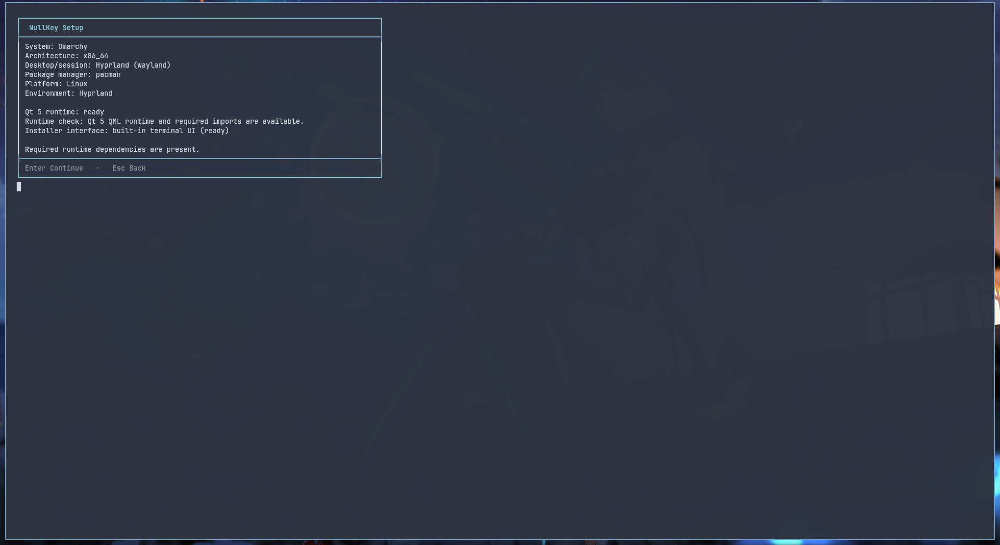

### 2. Select applications

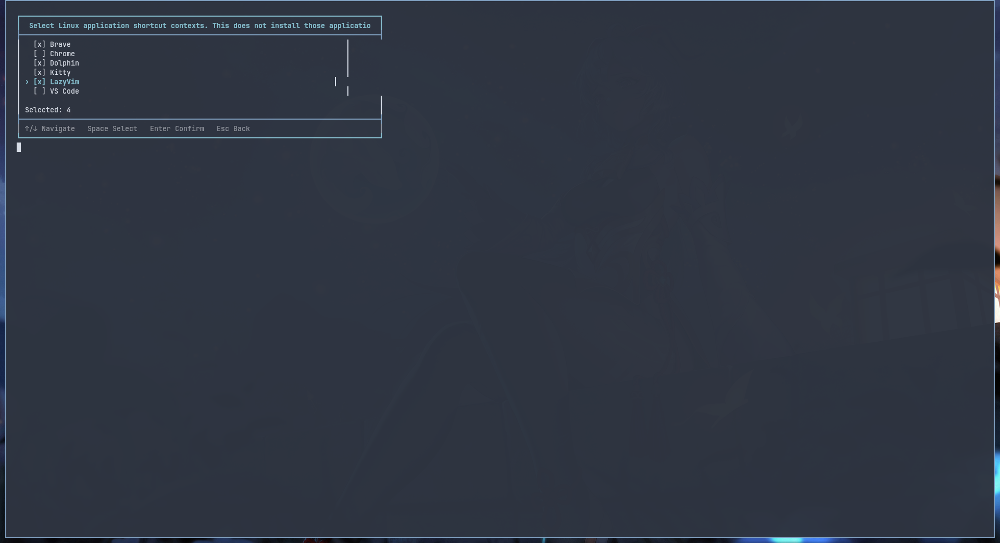

### 3. Select DE Dotfiles

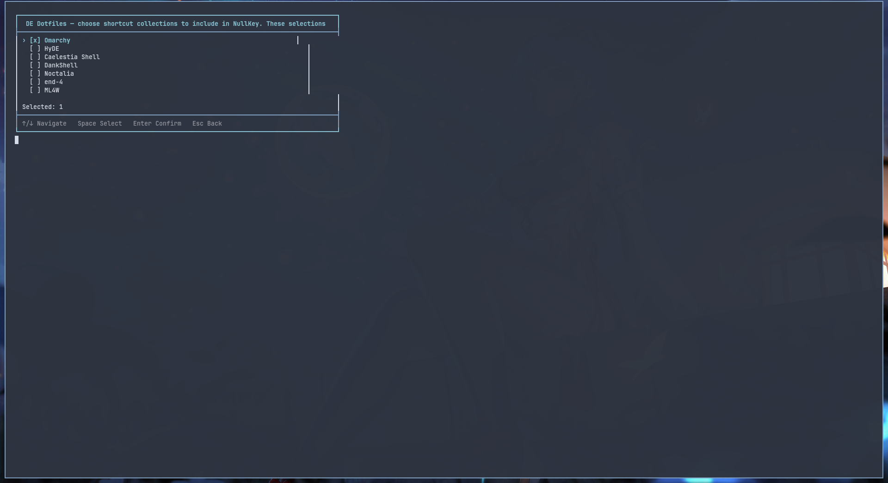

### 4. Review and install

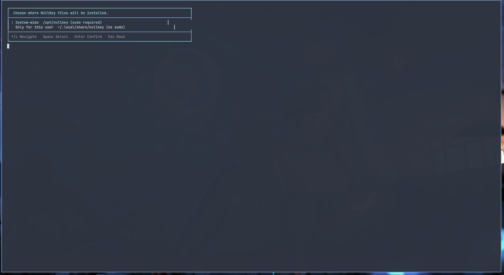

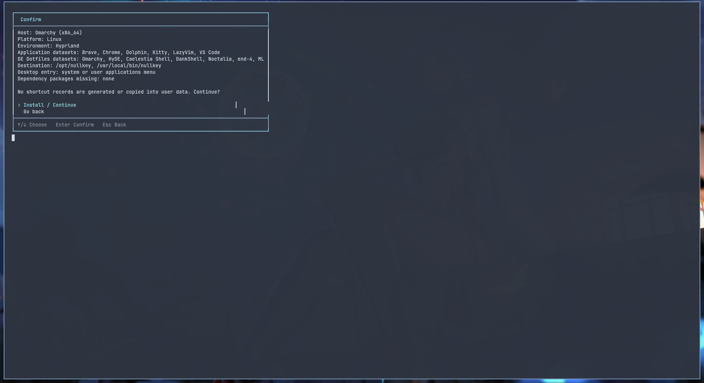

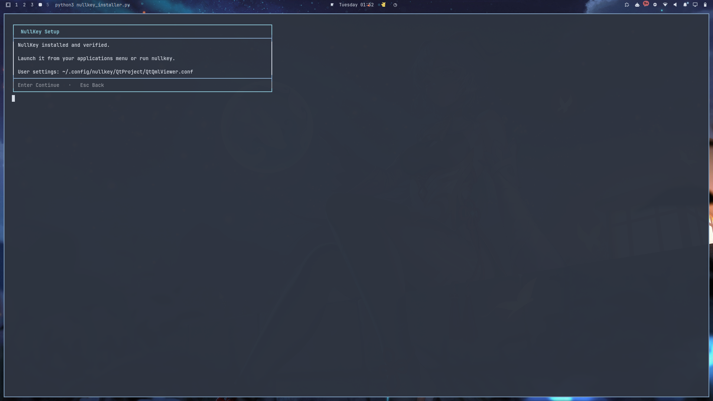

### 5. Installation complete

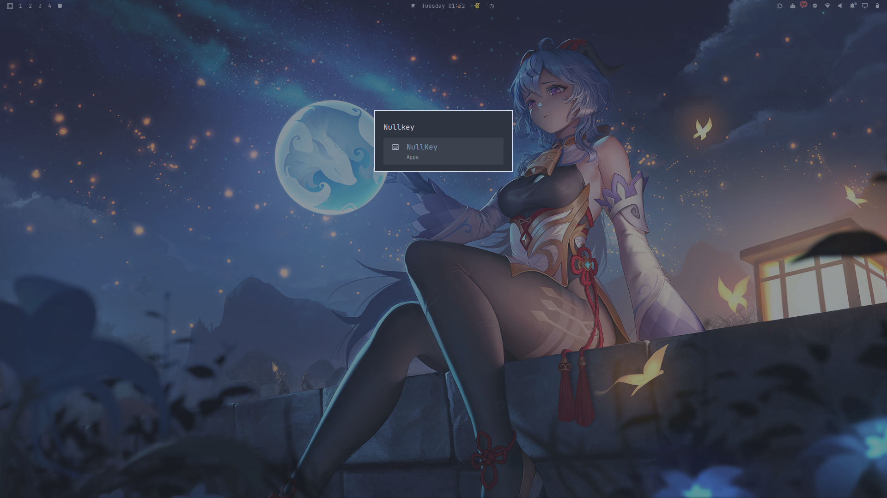

## Screenshots

### Explore

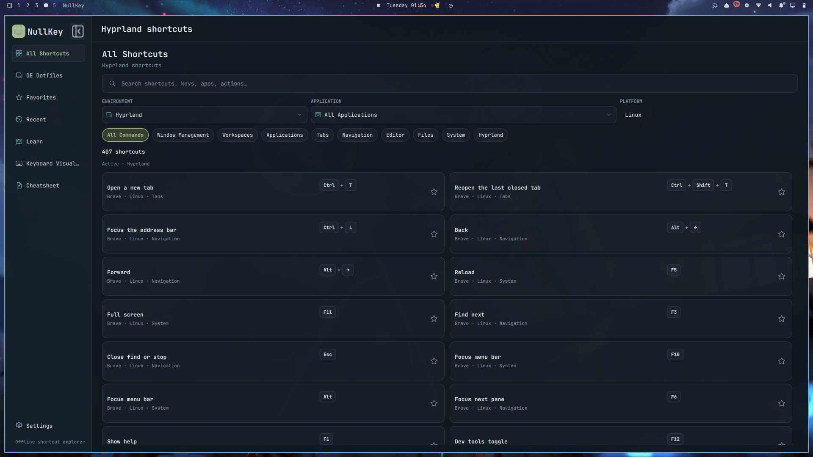

### DE Dotfiles

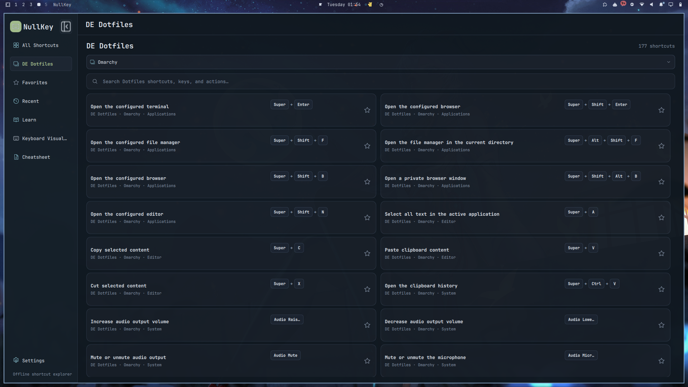

### Keyboard Visualizer

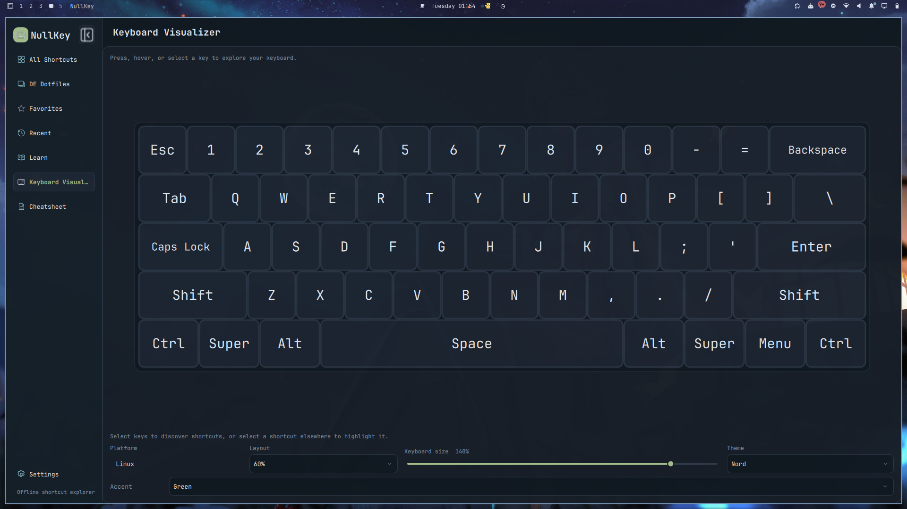

### Learn

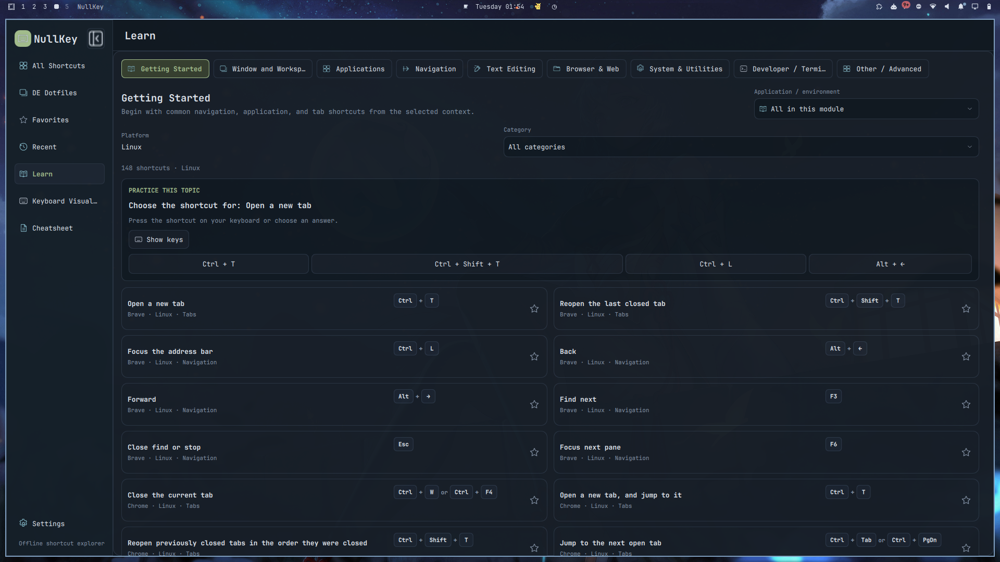

### Cheatsheet

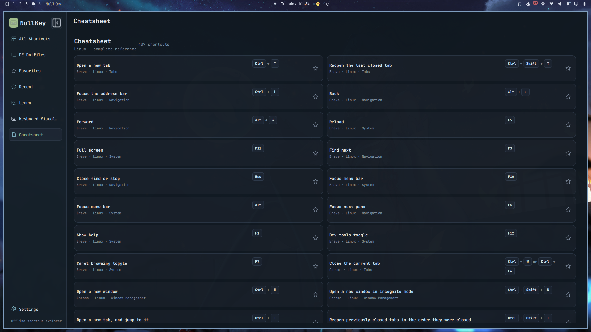

### Settings

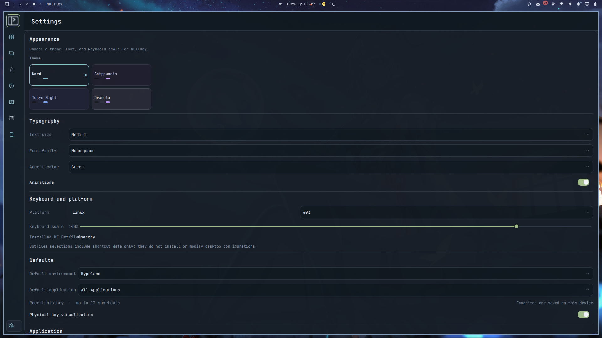

## How to use

### Explore

Browse by application, Hyprland, search, and shortcut category. Open **DE Dotfiles** to browse the collection selected during installation. One Dotfiles collection is active at a time; for example, Omarchy shows Omarchy shortcuts only, without application or Hyprland shortcuts.

### Keyboard Visualizer

Use the visualizer to press physical keys, inspect key details, build manual chords and sequences, and match shortcuts. Available layouts are **60%**, **Laptop**, and **Full Keyboard**.

## Uninstall

Run:

```sh
uninstall-nullkey
```

The uninstaller removes NullKey application files and preserves user settings by default. To remove configuration when prompted, use:

```sh
uninstall-nullkey --remove-config
```

## Development

Launch from the repository:

```sh
QML_XHR_ALLOW_FILE_READ=1 qmlscene main.qml
```

Validate data:

```sh
python3 tools/validate_data.py
```

Run tests:

```sh
python3 -m unittest discover -s tools/tests -p 'test_*.py'
QML_XHR_ALLOW_FILE_READ=1 QT_QPA_PLATFORM=offscreen qmltestrunner -input tools/tests
```

## Project structure

```text
NullKey/
├── components/     UI components
├── views/          Application pages
├── services/       Application services
├── data/           Bundled data
├── modules/        Shortcut modules
├── installer/      Installer
├── tools/          Validation and tests
└── docs/           Project documentation
```

Developed by **NullRoot**.
